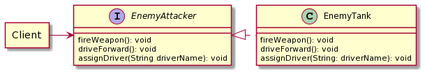
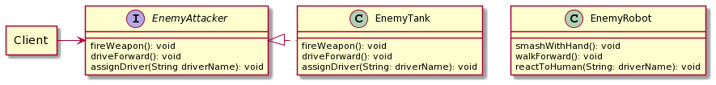
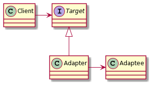
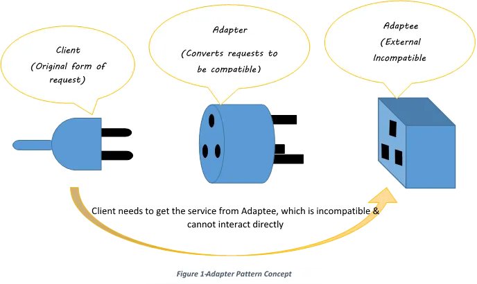
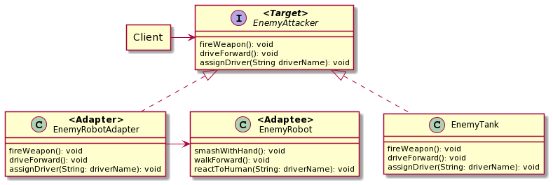

# 어댑터 패턴

클라이언트가 요구하는 인터페이스와 재사용하려는 모듈의 인터페이스가 일치하지 않을 때 사용할 수 있는 패턴

서로 다른 인터페이스를 가질 때 호환성을 제공해줄 수 있는 패턴

```
@startuml
allow_mixing
agent Client
interface "EnemyAttacker" as EA {
  fireWeapon(): void
  driveForward(): void
  assignDriver(String driverName): void
}

class "EnemyTank" as ET {
  fireWeapon(): void
  driveForward(): void
  assignDriver(String: driverName): void
}

Client -> EA
EA <|..right.. ET
@enduml
```

```
@startuml
allow_mixing
agent Client
interface "EnemyAttacker" as EA {
  fireWeapon(): void
  driveForward(): void
  assignDriver(String driverName): void
}
class "EnemyTank" as ET {
  fireWeapon(): void
  driveForward(): void
  assignDriver(String: driverName): void
}

class "EnemyRobot" as ER {
  smashWithHand(): void
  walkForward(): void
  reactToHuman(String: driverName): void
}

Client -> EA
EA <|.right. ET
@enduml
```

```
@startuml
allow_mixing
agent Client
interface "**<Target>**\nEnemyAttacker" as EA {
  fireWeapon(): void
  driveForward(): void
  assignDriver(String driverName): void
}

class "**<Adapter>**\nEnemyRobotAdapter" as ERA {
  fireWeapon(): void
  driveForward(): void
  assignDriver(String: driverName): void
}

class "EnemyTank" as ET {
  fireWeapon(): void
  driveForward(): void
  assignDriver(String: driverName): void
}

class "**<Adaptee>**\nEnemyRobot" as ER {
  smashWithHand(): void
  walkForward(): void
  reactToHuman(String: driverName): void
}

Client -> EA
EA <|.. ERA
EA <|.. ET
ERA -> ER
@enduml
```

## 클라이언트가 사용하려고 하는 기능



1. 모든 적은 무기를 발사 할 수 있다.
2. 운전자를 지정 할 수 있다.
3. 이동시킬 수 있다.

```java
public interface EnemyAttacker {
	public void fireWeapon();
	public void driveForward();
	public void assignDriver(String driverName);
}
```

```java
public class EnemyTank implements EnemyAttacker {
	
	Random generator = new Random();

	@Override
	public void fireWeapon() {
		int attackDamage = generator.nextInt(10) + 1;
		System.out.printf("적 탱크가 %d만큼의 피해를 입혔습니다.\n", attackDamage);
  }
	
	@Override
	public void driveForward() {
		int movement = generator.nextInt(5) + 1;
		System.out.printf("적 탱크가 %d만큼 이동했습니다.\n", movement);
	}

	@Override
	public void assignDriver(String driverName) {
				System.out.printf("%s가 탱크를 운전합니다.\n", driverName);
	}
}
```

## 요구사항



제공된 EnemyRobot을 EnemyAttacker 인터페이스를 활용하여 적을 추가하려고 한다.

```java
public class EnemyRobot {
	Random generator = new Random();

	public void smashWithhands() {
		// 무기를 사용하여 공격하는 의미와 같지만 로봇은 손을 이용하여 공격한다.
		int attackDamage = generator.nextInt(10) + 1;
		System.out.printf("적 로봇이 손을 사용하여 %d만큼의 피해를 입혔습니다.\n", attackDamage);
	}

	public void walkForward() {
		int movement = generator.nextInt(5) + 1;
		System.out.printf("적 로봇이 %d만큼 걸어서 이동했습니다.\n", movement);
	}

	public void reactToHuman(String driverName) {
		System.out.printf("적 로봇이 %s를 짓밟습니다.", driverName);
	}
}
```

## 문제

EnemyRobot은 EnemyAttacker의 재사용 모듈처럼보인다, 하지만 인터페이스를 호환하지 않는다.

### 고민

1. 인터페이스를 수정하면 되지 않을까? `OCP 위반`
2. EnemyRobot을 호환시키지 않고 그냥 사용하면 되지 않을까? `기능을 사용하는 입장에서 여러 객체가 하는 일을 알아야하므로, 유지보수가 어려워질 수 있다.`
3. EnemyRobot을 우리 인터페이스에 맞게 수정 할 순 없을까? `이미 제공된 기능이므로 직접 수정할 수 없다.`

## 해결 (Adapter Pattern 적용)

Client가 호환되지 않는 Target(Adaptee)을 Adapter를 활용해 사용한다.





- ***Client***

  – '타겟'인터페이스를 사용

- ***Target***

  – 클라이언트에서 사용하는 인터페이스

- ***Adapter***

  – 두 개의 호환되지 않는 시스템에서 요구하는대로 요청 및 응답을 변환하는 구성 요소

- ***Adaptee***

  – 어댑터 클래스에서 연결하거나 상속하는 수신 측 인터페이스

EnemyRobotAdapter를 구현하여 EnemyRobot을 호환시켜준다.



```java
public class EnemyRobotAdapter implements EnmyAttacker {
	EnemyRobot robot;

	public EnemyRobotAdapter(EnemyRobot robot) {
		this.robot = robot;
	}

	@Override
	public void fireWeapon() {
		robot.smashWithHands();
  }
	
	@Override
	public void driveForward() {
		robot.walkForward();
	}

	@Override
	public void assignDriver(String driverName) {
		robot.reactToHuman(driverName);
	}
}
```

```java
public class AttackGameTest {

	@Test
	void game() {
		List<EnemyAttacker> attackers = Arrays.asList(
			new EnemyTank(),
			new EnemyRobotAdapter(new EnemyRobot())
		);

		attackers.forEach(this::attack);
	}

	private void attack(EnemyAttacker attacker) {
		attacker.assignDriver("Taehun");
		attacker.driveForward();
		attacker.fireWeapon();
	}
}
```

# 참고

> [https://dev.to/carlillo/design-patterns---adapter-2pi3](https://dev.to/carlillo/design-patterns---adapter-2pi3)
[https://www.youtube.com/watch?v=qG286LQM6BU&t=113s](https://www.youtube.com/watch?v=qG286LQM6BU&t=113s)